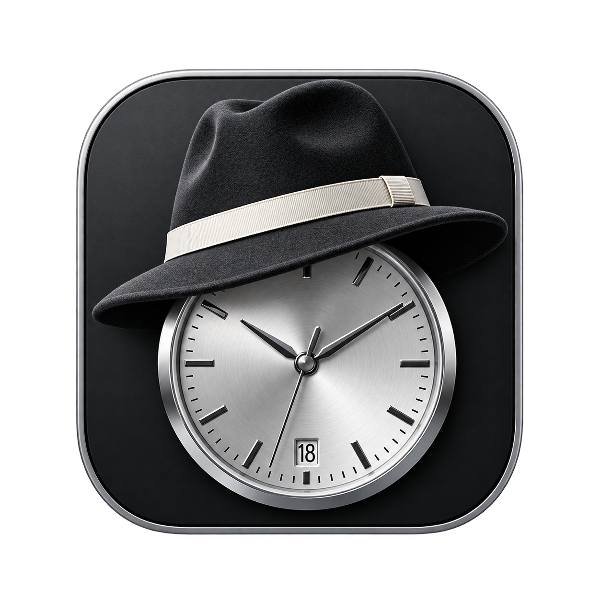

# Recall

### Never miss a moment with continuous retrospective screen capture on macOS.

Recall is a lightweight macOS menu bar application that records your display continuously in the background using native Apple hardware acceleration. When an unexpected bug, highlight, or memorable moment occurs, simply drag downward from the menu bar icon to retroactively export high-quality video clips in seconds.

<p align="center">
  
</p>

<p align="center">
  
  
  
  
  
  
</p>

---

## Why Recall?

Traditional screen recording forces you to predict when something important is going to happen. If you forget to hit record, fleeting bugs, unrepeatable software behavior, or unexpected presentation moments are lost forever. Conversely, keeping heavy screen recording tools running constantly drains system resources and clutters your storage.

**Recall solves this by turning screen capture into an effortless retrospective safety net.**

* **Silent & Weightless:** Runs continuously in the menu bar with zero-copy GPU frame handling, using minimal system resources.
* **Instant Time Retrieval:** Drag downward from the menu bar at any moment to select and export what just happened.
* **Controlled Disk Footprint:** Automatically manages storage with an automated rolling ring-buffer so disk space never overflows.

---

## Key Capabilities

### Continuous Background Buffer
Captures the main display continuously at 30 FPS using `CGDisplayStream` and hardware-accelerated H.264 encoding (`AVAssetWriter`) into rolling 30-second video chunks.

### Drag-to-Export Glassmorphism HUD
An interactive translucent beam (`OverlayHUDWindow`) appears when dragging down from the menu bar icon, calculating retroactive time offsets in real time with dynamic visual feedback.

### Zero-Copy Frame Pipeline
Directly binds `IOSurface` pixel buffers (`CVPixelBufferCreateWithIOSurface`) for GPU-to-buffer frame pass-through, eliminating CPU-to-GPU copying overhead.

### Automated Retention Management
`ChunkManager` monitors stored recording segments and automatically purges older chunks whenever user-defined storage limits (MB) or time thresholds (minutes) are reached.

### Single-Pass Lossless Video Export
Merges and trims selected chunks using `ffmpeg` stream copying without re-encoding, preserving original video quality and completing exports almost instantly. Includes an automatic `AVFoundation` fallback.

### TCC Permission Preservation
Incremental build automation (`build.sh`) checks binary timestamps before signing, avoiding redundant re-signing and keeping macOS Screen Recording permissions valid between developer builds.

---

## Product Experience

1. **Always-On Background Capture:** Recall launches quietly into your menu bar and maintains a continuous rolling history of your display activity.
2. **Drag to Select History:** Click and drag downward from the Recall menu bar icon. The translucent glassmorphism HUD beam tracks your gesture and previews the retrospective duration (e.g., `-2 min`, `-5 min`).
3. **Release to Export:** Release the mouse button. Recall immediately concatenates the relevant recording chunks and exports a crisp `.mp4` file directly to your designated folder.
4. **Instant File Reveal:** The exported video file is automatically highlighted in Finder for immediate sharing or archiving.

---

## What Makes It Different

* **Gesture-Driven Retrospective Export:** Instead of opening complex timeline editors, a quick downward drag from your status bar triggers clip generation.
* **Hardware-Native Architecture:** Built on low-level macOS frameworks (`CGDisplayStream`, `IOSurface`, `AVFoundation`) for minimal impact on system performance.
* **Smart Binary Timestamp Incremental Builds:** Resolves the common macOS developer friction point where re-compiling invalidates Screen Recording privacy permissions in System Settings.

---

## Primary Use Cases

* **Bug Capture & Software QA:** Instantly extract video proof of hard-to-reproduce software bugs right after they occur.
* **Meetings & Live Demos:** Save key segments from live presentations or virtual code reviews without recording hours of idle screen time.
* **Content & Game Highlights:** Capture spontaneous moments or gameplay achievements retroactively.

---

## Quick Start

### Download Pre-built Release

Download the latest styled `.dmg` installer disk image directly from [GitHub Releases](https://github.com/unamatasanatarai/recall/releases/latest), open the volume, and drag `Recall.app` to your Applications folder.

### Prerequisites (For Building From Source)

* macOS 12.3 or later
* Xcode Command Line Tools (`swiftc`, `codesign`)
* Optional: `ffmpeg` (for single-pass stream copy export; `AVFoundation` is used as fallback)

### Building & Running

Clone the repository and compile Recall using `make`:

```bash
git clone https://github.com/unamatasanatarai/recall.git
cd recall
make build
make run
```

To launch a compiled build without recompiling (preserving macOS Screen Recording TCC permissions):

```bash
make launch
```

---

## Developer Workflows

### Running Unit Tests & Coverage

Execute the automated Swift test suite:

```bash
make test
```

Generate a code coverage summary:

```bash
make coverage
```

### Packaging Installer DMG

Create a styled `.dmg` installer volume with custom background graphics:

```bash
make dmg
```

Output binary: `build/Recall-v1.0.0.dmg`.

### Automated Release Workflow

Run test verification, bump versioning, extract git commit changelogs, package a DMG, tag git, and publish a GitHub release:

```bash
# Auto-bump patch version and publish release
make release

# Specify explicit release version
make release VERSION=1.1.0
```

### Resetting TCC Permissions

Reset macOS Screen Capture privacy settings during testing:

```bash
make revoke
```

---

## Configuration

Settings can be customized via the Preferences window (`Cmd + ,` or right-click menu bar icon):

* **Export Location:** Output directory for exported clips. *(Default: `~/Movies/Recall-exports`)*
* **Max Size (MB):** Maximum disk buffer capacity for stored video chunks. *(Default: `1000 MB`)*
* **Max Time (Minutes):** Maximum historical time window retained. *(Default: `60 Minutes`)*

### Cache & Logging

* **Recording Chunks:** `~/.cache/recall/chunks/`
* **Debug Logs:** `~/.cache/recall/recall_debug.log` *(automatically rotated at 10 MB)*

---

## License

Licensed under the [GNU General Public License v2.0](LICENSE).
